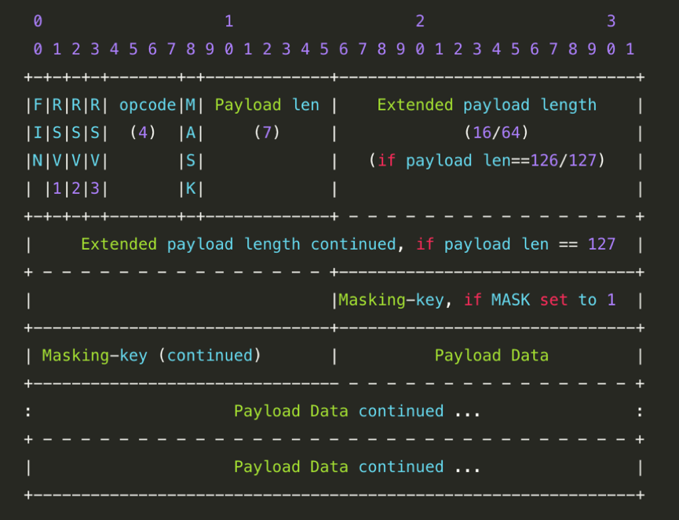

- **FIN**: 1 bit

  标记这个帧是不是消息中的最后一帧。第一个帧也可是最后一帧。

- **RSV1, RSV2, RSV3**: 1 bit each

  必须是0，除非有扩展赋予了这些位非0值的意义。

- **Opcode**: 4 bits

  定义了如何解释 “有效负荷数据 Payload data”。如果接收到一个未知的操作码，接收端必须标记 WebSocket 为失败。定义了如下的操作码：

  - `%x0` 表示这是一个继续帧（continuation frame）
  - `%x1` 表示这是一个文本帧 （text frame）
  - `%x2` 表示这是一个二进制帧 （binary frame）
  - `%x3-7` 为将来的非控制帧（non-control frame）而保留的
  - `%x8` 表示这是一个连接关闭帧 （connection close）
  - `%x9` 表示这是一个 ping 帧
  - `%xA` 表示这是一个 pong 帧
  - `%xB-F` 为将来的控制帧（control frame）而保留的

- **Mask**: 1 bit

  表示是否要对数据载荷进行掩码操作。所有的由客户端发往服务端的帧都必须设置为 1。如果被设置为 1，那么在 Masking-Key 部分将有一个掩码key，服务端需要使用它将 “有效载荷数据” 进行反掩码操作。从客户端向服务端发送数据时，需要对数据进行掩码操作；从服务端向客户端发送数据时，不需要对数据进行掩码操作。如果服务端接收到的数据没有进行过掩码操作，服务端需要断开连接。
  ​
  如果 Mask 是 1，那么在 Masking-key 中会定义一个掩码键（masking key），并用这个掩码键来对数据载荷进行反掩码。所有客户端发送到服务端的数据帧，Mask 都是 1。

- **Payload length**: 7 bits, 7+16 bits, or 7+64 bits

  - 如果是 0-125，那么就直接表示了负荷长度。
  - 如果是 126，那么接下来的两个字节表示(16位)负荷长度。
  - 如果是 127，则接下来的 8 个字节表示(64位)负荷长度。

- **Masking-Key**: 1 bit

  所有从客户端传送到服务端的数据帧，数据载荷都进行了掩码操作，Mask 为 1，且携带了 4 字节的 Masking-key。如果 Mask 为 0，则没有 Masking-key。